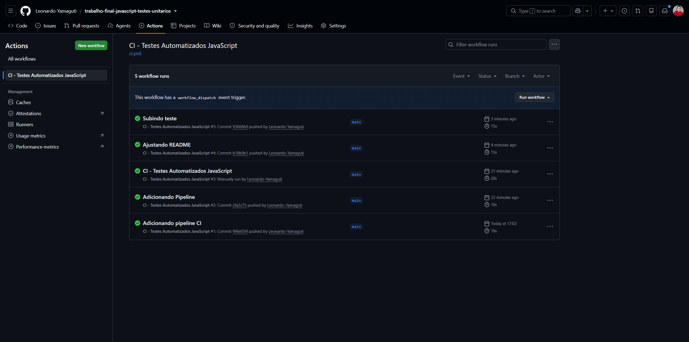
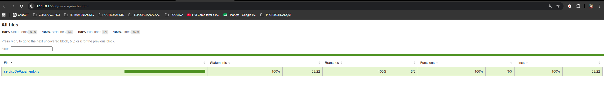

# Trabalho Final – CI/CD com GitHub Actions

## Descrição do Projeto

Este projeto tem como objetivo demonstrar a implementação de uma pipeline de Integração Contínua (CI) utilizando GitHub Actions em uma aplicação Node.js com testes automatizados.

A solução foi desenvolvida para atender aos requisitos da disciplina, contemplando execução automática, execução manual, execução agendada, geração de relatórios de testes e publicação de artefatos.

---

## Tecnologias Utilizadas

* Node.js
* JavaScript
* Mocha (framework de testes)
* C8 (cobertura de código)
* GitHub Actions
* npm

---

## Estrutura do Projeto

```text
.
├── .github
│   └── workflows
│       └── ci.yml
├── src
│   └── ...
├── test
│   └── ...
├── coverage
│   └── (gerado automaticamente)
├── package.json
└── README.md
```

---

## Objetivo da Pipeline

A pipeline foi criada para automatizar o processo de validação da aplicação, garantindo que:

* O código seja testado automaticamente após alterações.
* Os testes possam ser executados manualmente quando necessário.
* Haja execuções periódicas para validação contínua.
* Relatórios de cobertura sejam gerados e armazenados.
* O processo seja reproduzível e padronizado.

---

## Configuração da Pipeline

O workflow está definido no arquivo:

```text
.github/workflows/ci.yml
```

### Eventos que Disparam a Pipeline

#### 1. Execução por Push

A pipeline é executada automaticamente sempre que ocorre um push na branch principal.

```yaml
push:
  branches:
    - main
```

#### 2. Execução Manual

Permite iniciar a execução diretamente pela interface do GitHub Actions.

```yaml
workflow_dispatch:
```

#### 3. Execução Agendada

Executa automaticamente toda segunda-feira às 12:00 UTC.

```yaml
schedule:
  - cron: '0 12 * * 1'
```

---

## Fluxo de Execução

A pipeline executa as seguintes etapas:

### 1. Checkout do Código

Obtém a versão mais recente do repositório.

```yaml
- uses: actions/checkout@v4
```

### 2. Configuração do Ambiente

Instala as versões configuradas do Node.js.

```yaml
strategy:
  matrix:
    node-version: [20, 22]
```

Dessa forma, os testes são executados em múltiplas versões do ambiente de execução.

### 3. Instalação das Dependências

```yaml
npm ci
```

Garante a instalação exata das dependências definidas no projeto.

### 4. Execução dos Testes

```yaml
npm test
```

Executa todos os testes automatizados utilizando Mocha.

### 5. Geração da Cobertura de Código

```yaml
npm run coverage
```

Gera o relatório de cobertura utilizando a ferramenta C8.

### 6. Publicação dos Artefatos

```yaml
actions/upload-artifact@v4
```

Publica os relatórios gerados para consulta e download diretamente na execução do GitHub Actions.

---

## Testes Automatizados

Os testes automatizados foram implementados utilizando o framework Mocha.

Seu objetivo é validar o comportamento esperado das funcionalidades da aplicação, garantindo maior confiabilidade e reduzindo a probabilidade de regressões.

Execução local:

```bash
npm test
```

---

## Cobertura de Código

O projeto utiliza a ferramenta C8 para geração de métricas de cobertura.

Execução local:

```bash
npm run coverage
```

Após a execução, é criada a pasta:

```text
coverage/
```

Nela estão disponíveis os relatórios detalhados de cobertura da aplicação.

---

## Artefatos Gerados

Ao final de cada execução da pipeline, o relatório de cobertura é armazenado como artefato do GitHub Actions.

Para acessar:

1. Acesse a aba **Actions** do repositório.
2. Selecione uma execução concluída.
3. Localize a seção **Artifacts**.
4. Faça o download do relatório de cobertura.

---

## Conceitos de CI/CD Aplicados

Durante o desenvolvimento deste trabalho foram aplicados os seguintes conceitos:

### Integração Contínua (CI)

Automação da validação do código sempre que alterações são enviadas ao repositório.

### Automação de Testes

Execução automática dos testes para garantir a qualidade da aplicação.

### Build Reprodutível

Uso do comando `npm ci` para instalação consistente das dependências.

### Cobertura de Código

Medição do percentual do código exercitado pelos testes automatizados.

### Artefatos de Pipeline

Armazenamento dos relatórios gerados durante a execução para auditoria e análise posterior.

### Execução Agendada

Validação periódica da aplicação mesmo sem alterações recentes no código.


### Evidência



## Conclusão

A solução implementada atende aos requisitos propostos para o trabalho de CI/CD, utilizando GitHub Actions para automatizar testes, geração de relatórios e armazenamento de artefatos. A pipeline garante maior confiabilidade no processo de desenvolvimento e demonstra a aplicação prática dos conceitos de Integração Contínua estudados na disciplina.
